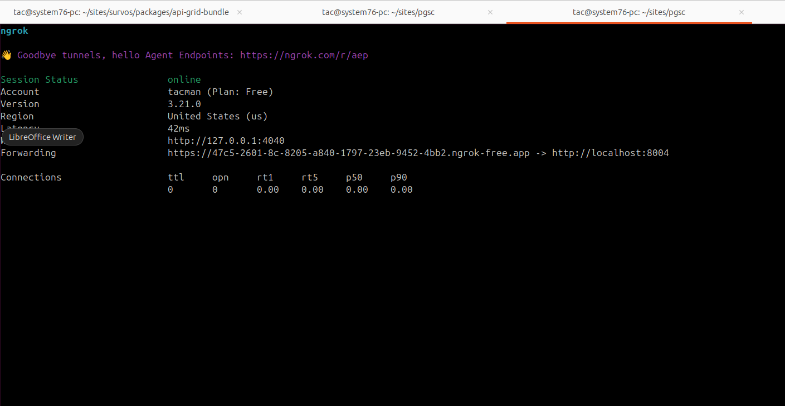

# simple framework7

## Developers only


```bash
git clone git@github.com:survos/fw-bundle.git 
git clone git@github.com:survos-sites/framework7-bundle-demo.git fw-demo
cd fw-demo
composer config repositories.fw7 '{"type": "path", "url": "../fw-bundle"}'
composer req survos/fw-bundle:dev-main
composer install
```

```bash
git clone git@github.com:survos-sites/framework7-bundle-demo.git
cd framework7-bundle-demo
composer install
symfony server:start -d
symfony open:local
```

run proxy server
```bash
symfony proxy:start
```

# Testing on Mobile

Install and configure ngrok (github auth token)

https://dashboard.ngrok.com/get-started/setup/

https://dashboard.ngrok.com/get-started/your-authtoken

Start ngrok on whatever PORT the symfony CLI uses
```bash
symfony server:status | grep List
grok http 8004
```

Now go to the forwarding link



You can now access the app remotely.

Now edit the .env.local file in pgsc and set the MOBILE_APP_URL to the ngrok url

```
MOBILE_BASE_URL=https://fw.wip

```
MOBILE_BASE_URL=https://fw.wip
